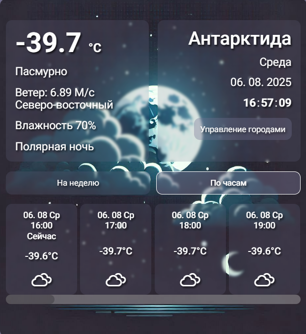

# Weather Widget

Responsive weather widget on native js.

Originally created for JavaScript practice, with a design improvised without a predefined layout.
Since then, I have adopted modern development approaches, but I keep this project as a reference point to showcase my progress.

## Functionality
- Automatic IP city detection (without requesting geolocation permission)
- Display current weather by geolocation
- Switch between cities
- Responsive design for mobile and desktop

## Screenshots

### Main screen


### Main screen


### Management pane


## Technologies
- HTML5, CSS3 (BEM)
- JavaScript
- OpenWeather API

## How to run
1. Clone the repository:
```bash
git clone https://github.com/Nikita-7onenko-dev/WeatherWidget.git
```

2. Run index.html file
